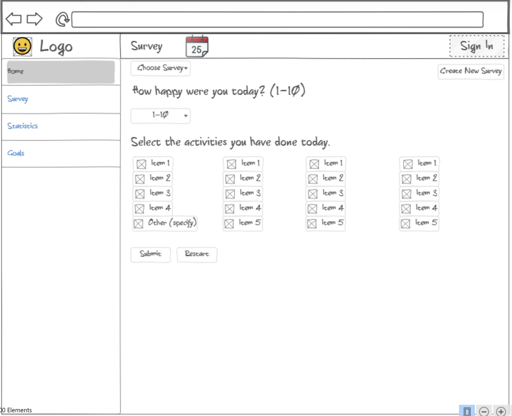
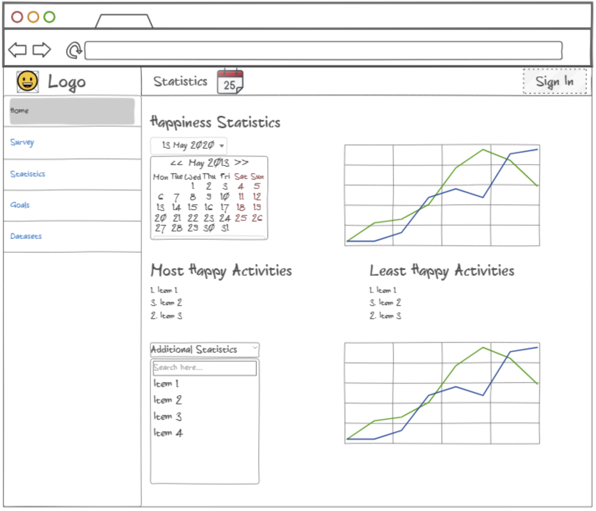

# Startup Specification

## Elevator Pitch

Have you ever felt that you wish you could know how to be more happy on a day-to-day basis? My startup is a website that tracks a user's happiness, and activities for a day and then tracks said data throughout a period and gives feedback on the data. Every day the user can log onto the app and be asked to give a scale for how happy they were that day. After putting this rating in they will be able to select what they did that day. This valuable data can be used to then figure out what activities make you happier and suggest how to improve your own life. This application will help people be more mindful of what they are doing in their day-to-day lives, how this affects their happiness, and what they can do to be more happy.

## Key Features

* A quick and easy survey that tracks the daily happiness of the user
* A survey that allows users to pick from a list of options for what they did today, and also allows them to create their own, which will be saved for all later surveys.
* Data is stored in a database that allows the user to track their progress over time
* Feedback on how you can better use your time to be more happy based on the data already given
* Graphical representations of the data showing how your happiness has changed over time and how often you are doing certain activities, easily downloadable too
* Notifications will be given that remind users to do the surveys at a user-specified time of the day
## How Technologies Will Be Used

### Authentication 
    
Users will be able to create personal accounts which will be connected to the data that they upload to the server through the daily surveys and the analysis of said data

### Database Data

The data collected through the daily surveys will be stored inside a database. It will hold the daily happiness levels, the activities done every day, and even the survey categories that the user comes up with themselves.

### WebSocket Data
    
This will be used to allow users to set up a time to be sent a reminder to do their daily survey. They can choose any time of the day. it will also update the graphs and statistics in real time to reflect a survey that was just taken.

## Rough Sketch of Website

Survey page when taking the daily survey.

Statistics page after being populated with enough data to display statistics.

