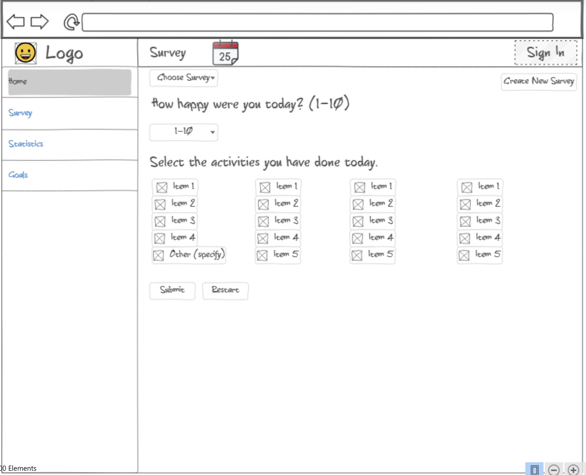
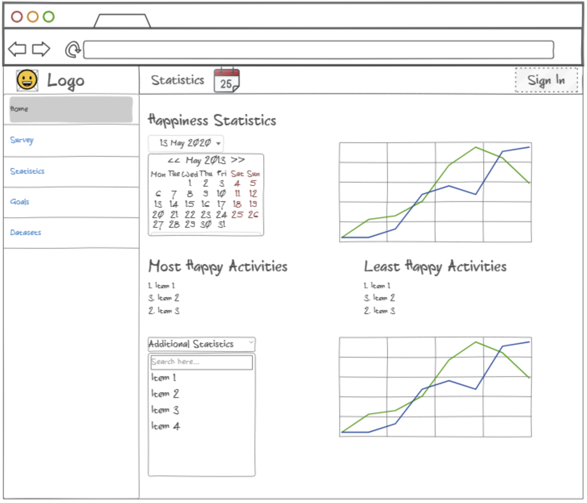
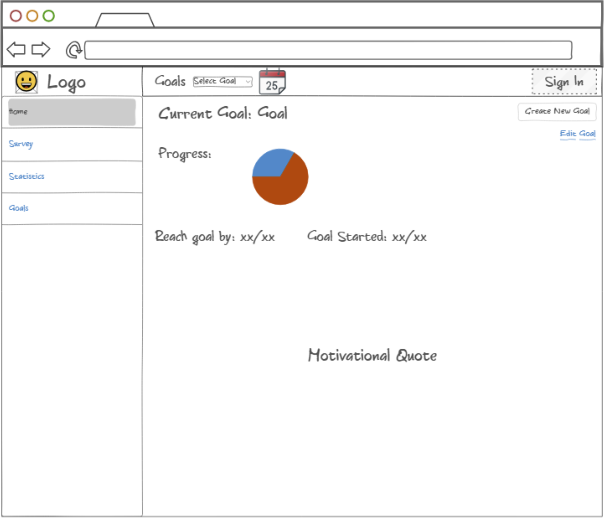

# Startup Specification

## Elevator Pitch

Have you ever felt that you wish you could know how to be more happy on a day to day basis? My startup is a website that tracks a user's happiness, and activities for a day and then tracks said data throughout a time period and gives feedback on the data. Every day the user can log onto the app and be asked to give a scale for how happy they were that day. After putting this rating in they will be able to select what they did that day. The app will take all this data and calculate the correlation between what you did on a day and how happy you were. This application should be able to help people be more mindful about what they are doing in their day to day life, how this affects their happiness, and what they can do to be more happy.

## Key Features

* A quick and easy survey that tracks the daily happiness of the user
* A survey that allows users to pick from a list of options for what they did today, and also allows them to create their own, which will be saved for all later surveys.
* Data is stored in a database that allows the user to track their progress over time
* The user has the option to create their own option for analysis such as food eaten, sleep had, time spent exercising
* Feedback on how you can better use your time to be more happy based on the data already given
* Graphical representations of the data showing how your happiness has changed over time and how often you are doing certain activites, easily downloadable too
* Yearly reviews showing how you have improved over the year and your happiest activities you did throughout the year.
* Allow users to create goals that will be tracked and notified when they are reached.

## How Technologies Will Be Used

### Authentication 
    
    Users will be able to create their own accounts which will be connected to the data that they upload to the server throught he daily surveys and the analysis of said data

### Database Data

    The data collected through the daily surveys will be stored inside of a database. It will hold the daily happiness levels, the activities done every day, and even the survey categories that the user comes up with themselves.

### WebSocket Data
    
    This will be used to allow users to set up a time to be sent a reminder to do their daily survey. They can choose anytime of the day. It can also send users a notification when they reach their achievments, using the real time input of the surveys to compute this. 

## Rough Sketch of Website

